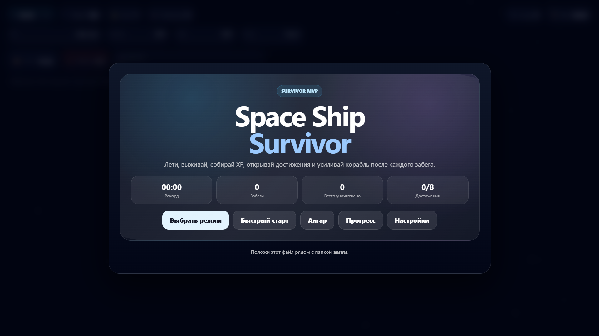
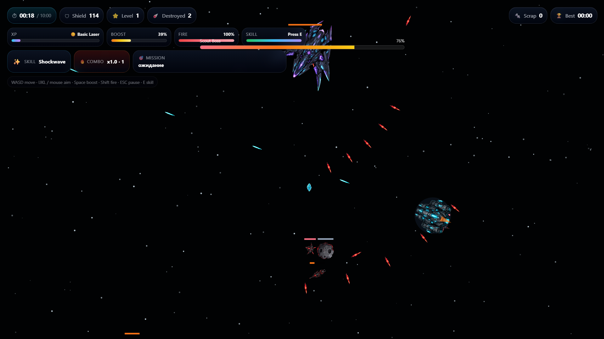
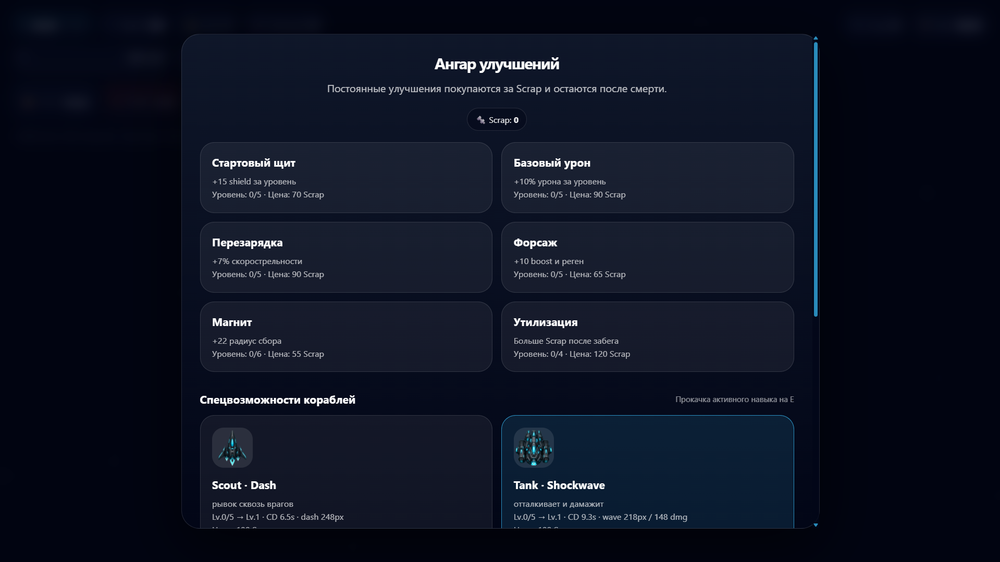

# 🚀 Space Ship Survivor — Assets Edition

**Space Ship Survivor** — браузерная 2D arcade/survivor-игра на чистом **HTML + CSS + JavaScript Canvas**.

Игрок управляет космическим кораблём, выживает против волн врагов, собирает опыт, получает Scrap, открывает достижения, прокачивает корабли и усиливает ангар после каждого забега.

Проект сделан как **MVP survivor-игры**, которую можно запускать прямо в браузере без сборщиков, фреймворков и серверной части.

---

## 🎮 Игровой процесс

Игрок появляется на космической арене и должен продержаться как можно дольше.

Во время забега нужно:

- уничтожать астероиды, дронов и боссов;
- собирать опыт и Scrap;
- повышать уровень корабля;
- выбирать временные улучшения;
- выполнять миссии;
- использовать активный навык корабля;
- выживать до финального времени или играть в бесконечном режиме.

---

## ✨ Возможности

- Полностью браузерная игра на Canvas
- Один основной файл `index.html`
- Несколько игровых режимов
- Выбор корабля перед стартом
- Уникальные пассивные бонусы кораблей
- Активный навык на клавишу `E`
- Прокачка навыков кораблей
- Ангар постоянных улучшений
- Опыт, уровни, Scrap и достижения
- Боссы с отдельной полосой здоровья
- Миссии внутри забега
- Безопасные зоны и случайные события на карте
- Настройки музыки и обучения
- Сохранение прогресса через `localStorage`
- Адаптивный интерфейс для компьютера и мобильных устройств
- Поддержка внешних PNG-ассетов
- Фоновая музыка через `music/background.mp3`

---

## 🕹️ Управление

| Действие | Клавиша |
|---|---|
| Движение | `WASD` / стрелки |
| Прицеливание | мышь |
| Прицеливание с клавиатуры | `IJKL` |
| Форсаж | `Space` |
| Усиленная стрельба | `Shift` |
| Активный навык | `E` |
| Пауза | `Esc` / `P` |

---

## 🚀 Запуск проекта

### Вариант 1 — открыть напрямую

Можно открыть файл `index.html` прямо в браузере.

```bash
index.html
```

### Вариант 2 — запустить через локальный сервер

Рекомендуется для корректной загрузки ассетов и музыки.

```bash
npx serve .
```

или

```bash
python -m http.server 8080
```

После запуска открой в браузере:

```bash
http://localhost:8080
```

---

## 📁 Структура проекта

```txt
space-ship-survivor/
├── index.html
├── README.md
├── music/
│   └── background.mp3
└── assets/
    ├── ships/
    │   ├── scout.png
    │   ├── tank.png
    │   ├── engineer.png
    │   ├── gunner.png
    │   └── phantom.png
    ├── enemies/
    │   ├── asteroid_small.png
    │   ├── asteroid_big.png
    │   ├── drone_fast.png
    │   ├── drone_sniper.png
    │   ├── mine.png
    │   ├── magnet.png
    │   └── shield.png
    ├── bosses/
    │   ├── scout_boss.png
    │   ├── laser_boss.png
    │   ├── asteroid_titan.png
    │   └── mothership.png
    ├── items/
    │   ├── xp.png
    │   ├── xp_rare.png
    │   ├── scrap.png
    │   ├── health.png
    │   └── energy.png
    ├── effects/
    │   ├── laser_cyan.png
    │   ├── laser_red.png
    │   ├── plasma_beam.png
    │   ├── explosion_small.png
    │   ├── explosion_big.png
    │   ├── shield_hit.png
    │   ├── level_up.png
    │   └── boost_flame.png
    └── ui/
        ├── upgrade_damage.png
        ├── upgrade_fire_rate.png
        ├── upgrade_shield.png
        ├── upgrade_speed.png
        ├── upgrade_magnet.png
        ├── upgrade_pierce.png
        ├── upgrade_crit.png
        ├── upgrade_regen.png
        ├── scrap_icon.png
        └── boss_warning.png
```

---

## 🚀 Корабли

| Корабль | Роль | Описание |
|---|---|---|
| Scout | Скорость и комбо | Быстрый корабль с уклонением и увеличенным окном комбо |
| Tank | Защита | Прочный корабль с большим щитом и сниженным входящим уроном |
| Engineer | Поддержка | Корабль с усиленным магнитом, регенерацией и улучшенными зонами |
| Gunner | Урон | Боевой корабль с двойным лазером и высокой скорострельностью |
| Phantom | Манёвренность | Корабль с мощным форсажем и сниженным уроном во время ускорения |

У каждого корабля есть:

- пассивные бонусы;
- собственный стиль игры;
- активный навык;
- отдельный уровень прокачки навыка.

---

## 🧠 Активные навыки

| Корабль | Навык | Эффект |
|---|---|---|
| Scout | Dash | Быстрый рывок сквозь врагов |
| Tank | Shockwave | Отталкивает и наносит урон врагам вокруг корабля |
| Engineer | Repair Field | Создаёт ремонтную зону для восстановления щита |
| Gunner | Overload | Временно усиливает огневую мощь |
| Phantom | Ghost Mode | Позволяет безопаснее проходить через врагов |

Навыки можно улучшать в ангаре за Scrap.

---

## 🎯 Игровые режимы

| Режим | Описание |
|---|---|
| Классика | Нужно выжить 10 минут |
| Свободная игра | Бесконечный режим выживания |
| Boss Rush | Серия сражений с боссами |
| Миссионный забег | Победа через выполнение миссий |
| Hardcore | Более опасные враги и повышенная награда |
| Daily Challenge | Усиленный испытательный забег |

---

## 🏆 Прогресс

Игра сохраняет прогресс в браузере через `localStorage`.

Сохраняются:

- количество Scrap;
- лучшее время выживания;
- выбранный корабль;
- постоянные улучшения ангара;
- уровни навыков кораблей;
- достижения;
- статистика забегов;
- настройки.

Ключ сохранения:

```js
sss_assets_edition_v1
```

---

## 🔧 Улучшения в ангаре

Постоянные улучшения в ангаре:

- стартовый щит;
- базовый урон;
- скорострельность;
- форсаж;
- магнит;
- увеличение получаемого Scrap;
- улучшение навыков кораблей.

Эти улучшения сохраняются после смерти и работают в следующих забегах.

---

## 🏅 Достижения

Достижения дают игроку бонусный Scrap один раз.

Примеры достижений:

- первый запуск;
- первая минута;
- стабильный пилот;
- охотник;
- уничтожитель боссов;
- достижение 10 уровня;
- накопление Scrap;
- выживший.

---

## 🎵 Музыка

Игра ожидает фоновую музыку по пути:

```txt
music/background.mp3
```

Путь можно изменить внутри кода:

```js
const MUSIC_URL = './music/background.mp3'
```

Музыка запускается только после первого действия пользователя, потому что браузеры ограничивают автоматическое воспроизведение аудио.

---

## 🖼️ Ассеты

Все изображения загружаются из папки `assets`.

Если изображение отсутствует, игра всё равно попытается запуститься, но объект может отображаться без нужного спрайта.

Рекомендуемый формат ассетов:

- PNG с прозрачностью;
- оптимизированные PNG или WebP для продакшена;
- небольшие читаемые спрайты;
- единый аркадный или top-down стиль.

---

## 🛠️ Технологии

- HTML5
- CSS3
- JavaScript
- Canvas API
- LocalStorage
- Web Audio API
- Без фреймворков
- Без сборки

---

## 📌 Текущий статус

Проект находится на стадии **MVP / прототипа**.

Уже реализовано:

- основной игровой цикл;
- движение игрока;
- появление врагов;
- стрельба;
- временные улучшения;
- выбор кораблей;
- игровые режимы;
- достижения;
- система боссов;
- сохранение прогресса;
- интерфейс и меню.

---

## 🧩 План развития

- [ ] Разделить код на отдельные файлы
- [ ] Добавить удобное мобильное управление
- [ ] Добавить больше типов врагов
- [ ] Добавить новые атаки боссов
- [ ] Улучшить визуальные эффекты взрывов
- [ ] Добавить набор звуковых эффектов
- [ ] Добавить настройку громкости
- [ ] Добавить переключение языка
- [ ] Добавить PWA-режим
- [ ] Добавить таблицу лидеров
- [ ] Добавить прототип онлайн-кооператива
- [ ] Перенести проект на Vite
- [ ] Оптимизировать ассеты для продакшена

---

## 🌐 Деплой

Проект можно разместить на любом статическом хостинге:

- GitHub Pages
- Netlify
- Vercel
- обычный хостинг

### Деплой на GitHub Pages

1. Загрузи проект в репозиторий GitHub.
2. Открой настройки репозитория.
3. Перейди в раздел **Pages**.
4. Выбери ветку `main`.
5. Выбери корневую папку `/`.
6. Сохрани настройки и дождись публикации.

---

## 📸 Скриншоты

После добавления изображений в репозиторий можно оформить блок так:





---

## 👨‍💻 Автор

Проект создан **Темирхан Рустемов**.

---

## 📄 Лицензия

Проект можно использовать для обучения, прототипирования и дальнейшей разработки.

При желании можно добавить лицензию, например:

```txt
MIT License
```
